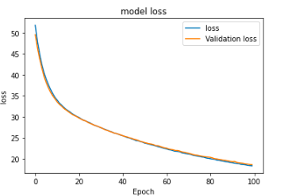

# 🛑 Note: This model is still not reliable to use. It is just a research for now. 

To read Motivation and Goal behind this research go to this [Github Repository](https://github.com/ieee8023/covid-chestxray-dataset/blob/master/README.md).
# Dataset 
```
dataset
├── test
│   ├── covid19 [32 entries]
│   ├── normal [25 entries]
│   └── pneumonia [20 entries]
├── train
│   ├── covid19 [219 entries]
│   ├── normal [210 entries]
│   └── pneumonia [210 entries]
└── validate
    ├── covid19 [32 entries]
    ├── normal [20 entries]
    └── pneumonia [20 entries]
```
Soon more data will be added


# Model Design
## covidcnn161
It is a custom model designed using Residual Blocks. Learn more about [Residual block](https://arxiv.org/abs/1512.03385)


* New model based on **Densenet moudule** comming soon.

# Model Result




* This model was trained on **very small sets of images**, therfore the model is not **generalized** enough to use. 

# Usage
```
$python3 detect.py --help
usage: detect.py [-h] -m MODEL -i IMAGE

optional arguments:
  -h, --help            show this help message and exit
  -m MODEL, --model MODEL
                        path to model
  -i IMAGE, --image IMAGE
                        path to input image

```
Example
```
python3 detect.py -m model/trained_model/covid-19_large.h5 -i model/samples/normal.jpeg 
```


# Deploying model

After the model was trained it was compressed into [tflite](https://www.tensorflow.org/lite/) model. After which it was 
deployed on [flutter](https://flutter.dev/) application.
## ScreenShots of Flutter application


model has been deplyed on a [WebApp](https://covid-scanner.herokuapp.com/)


# Dataset source 
- [Covid19](https://github.com/ieee8023/covid-chestxray-dataset).
- [pnemonia and normal X-ray](https://data.mendeley.com/datasets/rscbjbr9sj/2)


This repository will be updating as the dataset will grow more and more.
Any contribution would be appreciated.

**more detailed documentation comming soon**


# Citation

Paper availabe [here](https://arxiv.org/abs/2003.11597)


```
@article{cohen2020covid,
  title={COVID-19 image data collection},
  author={Joseph Paul Cohen and Paul Morrison and Lan Dao},
  journal={arXiv 2003.11597},
  url={https://github.com/ieee8023/covid-chestxray-dataset},
  year={2020}
}
```


